# OpenSearch Agent Workflow Diagram

This diagram illustrates the sophisticated multi-round research workflow implemented in the OpenSearch agent, including knowledge gap tracking, concurrent processing, and strategic follow-up query generation.

## Architecture Overview

The OpenSearch agent implements a sophisticated multi-round research workflow with the following key features:

- **Knowledge Gap Tracking**: Maintains history of attempted research gaps with smart abandonment logic
- **Concurrent Processing**: Parallel execution of gap analysis and fact extraction for efficiency  
- **Strategic Query Generation**: Diverse follow-up queries that avoid repetition and target specific gaps
- **Context Optimization**: Fact extraction reduces token usage while preserving citation accuracy
- **Real-time UI Updates**: Event-driven architecture with progress visualization

## Workflow Diagram

```mermaid
flowchart TD
    Start([User Input: Research Topic]) --> InitQuery[**Generate Initial Queries**<br/>📝 GenerateQuery BAML Function<br/>- Create search queries<br/>- Generate query plan<br/>- Set research questions]
    
    InitQuery --> InitState[**Initialize Agent State**<br/>🔄 Round 1 of Max 10<br/>- Empty knowledge gap history<br/>- Track answered/unanswered questions<br/>- Initialize extracted facts array]
    InitState --> SearchExec[**Execute Web Searches**<br/>🔍 Parallel Exa API Calls<br/>- Rate limited at 5 RPS<br/>- Full text and highlights<br/>- Generate unique IDs]

    
    SearchExec --> Reflect[**Reflection Analysis**<br/>🧠 Reflect BAML Function<br/>- Gap closure assessment<br/>- Question progress tracking<br/>- Identify relevant sources<br/>- Overall sufficiency check]
    
    Reflect --> CheckSufficient{Research<br/>Sufficient?}
    
    CheckSufficient -->|Yes| AnswerPath[Generate Final Answer]
    CheckSufficient -->|No| ConcurrentPhase[Concurrent Processing Phase]
    
    ConcurrentPhase --> GapAnalysis[**Knowledge Gap Analysis**<br/>🎯 AnalyzeKnowledgeGaps BAML<br/>- Review gap history<br/>- Apply abandonment criteria<br/>- Select next gap to research<br/>- Update gap statuses]
    
    ConcurrentPhase --> FactExtract[**Fact Extraction**<br/>📊 ExtractRelevantFacts BAML<br/>- Process relevant sources only<br/>- Extract concise facts<br/>- Maintain source attribution<br/>- Reduce context length]
    
    GapAnalysis --> ShouldContinue{Should Continue<br/>Research?}
    ShouldContinue -->|No - All gaps<br/>resolved/abandoned| AnswerPath
    
    ShouldContinue -->|Yes - Active gaps<br/>worth pursuing| FollowUpGen[**Generate Follow-up Queries**<br/>🔄 GenerateFollowUpQueries BAML<br/>- Target specific knowledge gap<br/>- Ensure query diversity<br/>- Avoid previous failed attempts<br/>- Strategic query angles]
    
    FollowUpGen --> UpdateState[**Update Agent State**<br/>📈 Increment Round Counter<br/>- Update gap history<br/>- Set current gap index<br/>- Track query attempts<br/>- Add extracted facts]
    
    UpdateState --> MaxRounds{Max Rounds<br/>Reached?}
    MaxRounds -->|Yes| ForceAnswer[Force Answer Generation<br/>⚠️ Max rounds reached<br/>Generate with available info]
    MaxRounds -->|No| SearchExec
    
    AnswerPath --> FactsAvailable{Extracted Facts<br/>Available?}
    FactsAvailable -->|Yes| CreateFromFacts[Create Answer from Facts<br/>📄 CreateAnswerFromFacts BAML<br/>- Use extracted facts<br/>- Maintain citations<br/>- Process footnotes]
    FactsAvailable -->|No| CreateFromResults[Create Answer from Results<br/>📄 CreateAnswer BAML<br/>- Use search results<br/>- Generate citations<br/>- Process footnotes]
    
    CreateFromFacts --> FinalAnswer[📋 Final Answer with Citations]
    CreateFromResults --> FinalAnswer
    ForceAnswer --> FinalAnswer
    
    %% Styling
    classDef bamlFunction fill:#e1f5fe,stroke:#01579b,stroke-width:2px
    classDef concurrent fill:#f3e5f5,stroke:#4a148c,stroke-width:2px
    classDef decision fill:#fff3e0,stroke:#e65100,stroke-width:2px
    classDef endpoint fill:#e8f5e8,stroke:#2e7d32,stroke-width:2px
    classDef warning fill:#ffebee,stroke:#c62828,stroke-width:2px
    
    class InitQuery,Reflect,GapAnalysis,FactExtract,FollowUpGen,CreateFromFacts,CreateFromResults bamlFunction
    class ConcurrentPhase concurrent
    class CheckSufficient,ShouldContinue,MaxRounds,FactsAvailable decision
    class Start,FinalAnswer endpoint
    class ForceAnswer warning
```



## Key Workflow Components

### 1. Knowledge Gap Tracking System
- **Gap History**: Tracks all attempted knowledge gaps with status (active/abandoned/resolved)
- **Smart Abandonment**: 3-round rule plus thoroughness assessment
- **Strategic Selection**: Prioritizes gaps addressing unanswered query plan questions

### 2. Concurrent Processing Architecture
- **Gap Analysis**: Strategic decisions about research continuation
- **Fact Extraction**: Context optimization while preserving citations
- **Parallel Execution**: Improves overall research speed

### 3. Query Diversity Strategy
- **Historical Awareness**: Analyzes all previous queries for current gap
- **Multi-angle Approach**: Different keywords, search perspectives, specificity levels
- **Repetition Avoidance**: Ensures new queries don't repeat failed attempts

### 4. Context Optimization
- **Before**: Accumulate full search result text (high token usage)
- **After**: Extract concise facts relevant to query plan (80-90% reduction)
- **Preservation**: Maintains source attribution for accurate citations

### 5. Abandonment Logic
- **3-Round Rule**: Abandon gaps attempted for 3+ rounds without progress
- **Thoroughness Assessment**: AI evaluates if gap has been researched thoroughly
- **Information Availability**: Conclude if information likely doesn't exist publicly

## Step Types and Event Flow

### CLI Application Steps
```typescript
type Step = 
  | 'input'                        // User research topic
  | 'queries-generated'            // Initial or follow-up queries
  | 'searching'                    // Web search execution
  | 'search-results'               // Search results collected
  | 'reflection-complete'          // Gap closure analysis
  | 'knowledge-gap-analysis'       // Strategic gap decisions
  | 'followup-query-generation'    // Targeted query generation
  | 'summarization'                // Fact extraction process
  | 'max-steps-reached'            // Round limit enforcement
  | 'answer'                       // Final research answer
```

### Concurrent Processing Benefits
- **Efficiency**: Gap analysis and fact extraction run in parallel
- **Context Optimization**: Extracted facts reduce LLM token usage
- **Strategic Focus**: Gap analysis provides targeted research direction
- **Quality Preservation**: Maintains research depth while optimizing performance

This sophisticated workflow enables the OpenSearch agent to conduct thorough, strategic research while avoiding infinite loops and optimizing for both quality and efficiency. 